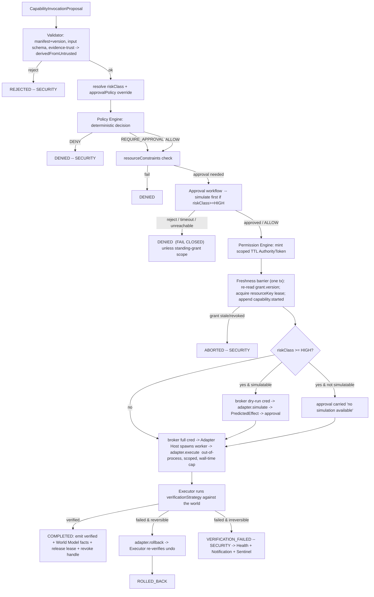

# Agency Model

How JARVIS acts on the world: capabilities, the single Executor pipeline, the
action lifecycle, simulation, verification, rollback, partial-execution
recovery, the credential model, and self-extension (L18–L24, L28–L31, L38).

Subordinate to [`PRINCIPLES.md`](PRINCIPLES.md),
[`SECURITY_MODEL.md`](SECURITY_MODEL.md). As-designed by ADR-0016 (manifests +
single Executor) and its HEPHAESTUS expansion ADR-0025..0030.

---

## 1. Principle

**Every consequential action is a capability invocation through one pipeline.**
There is no other way to affect the world. Cognition, agents, interfaces, the
Objective Engine, and even the Guardian playbook *propose*; the Capability
Executor is the only thing that *does*. Credential partitioning makes the
Executor the only reachable effect path — an adapter is not linkable or
callable except from the Adapter Host, which is driven only by the Executor.

## 2. Capability contract (`packages/contracts/src/capability.ts`)

A capability is **data (a manifest) + an out-of-process adapter**. Registering
one touches only the Capability Registry (L28); the Kernel binary does not
change (L29).

```
Capability {
  id                    "capabilities.<provider>"          -- ^capabilities\.[a-z][a-z0-9_]*$
  version               semver
  description           string
  provider              string
  actions               CapabilityAction[]
  requiredScopes        string[]                            -- grant must include
  trustTierMin          NodeTrustTier                       -- lowest node trust to host the adapter
  executionEnvironment  'worker' | 'worker+container' | 'node-local:<nodeId>'
  auditPolicy           { hashInput, recordOutput: 'none'|'summary'|'full' }
  privacyRequirements   { maxContentPrivacyClass }
  resourceKeySelector?  string                              -- mutual-exclusion lease key from input
}

CapabilityAction {
  name                  string
  inputSchema           JSONSchema   (generated from a zod schema by the SDK)
  outputSchema          JSONSchema
  riskClass             AMBIENT | LOW | MEDIUM | HIGH | CRITICAL
  reversible            boolean
  idempotent            boolean
  requiredScopes        string[]
  approvalPolicy         'default' | 'always' | 'hard_confirmation' | 'preauthorized:<scope>'  -- restrict-only
  timeoutMs             number
  verificationStrategy  VerificationStrategy   -- REQUIRED, Executor-run (L22)
  rollbackStrategy?     RollbackStrategy       -- REQUIRED if reversible && sideEffects != []
  simulate?             ActionRef
  simulatable           boolean               -- false => Executor escalates approval, never fakes
  idempotencyKeySelector? string
  confirmationPhrase?   string                -- REQUIRED present when riskClass == CRITICAL
  declaredEgress?       string[]              -- hostnames ctx.http may reach
  steps?                Step[]                -- multi-step; each with verify + compensate
  sideEffects           string[]              -- human-readable; consumed by policy, Sentinel, audit
}

VerificationStrategy =
  | { kind: 'world-read',   adapterRef }         -- re-read the world, assert
  | { kind: 'event-await',  eventType, matchPath, timeoutMs }
  | { kind: 'hash-match',   ofPath, expectPath }
  | { kind: 'health-probe', adapterRef }
  | { kind: 'state-echo',   adapterRef }         -- device reported-state == requested

RollbackStrategy =
  | { kind: 'inverse-action',   adapterRef }
  | { kind: 'restore-snapshot', capturedBy, restoreRef }
  | { kind: 'saga-compensate' }                  -- steps[].compensate
```

Manifests are authored with `@jarvis/capability-sdk` `defineCapability()`
(ADR-0030); the SDK generates `inputSchema`/`outputSchema` and the worker
entrypoint. **Security lint** (`scripts/lint.mjs` over `capabilities/**`) makes
the insecure moves un-shippable: no `process.env` secret read, no
`child_process`/`vm` unless `provider === 'terminal'`, no bare `fetch` (use
`ctx.http`), `verify` present per action, `rollback` present per reversible
side-effecting action, no active-intrusion verb in `sideEffects`.

## 3. The Executor pipeline (the only path to an effect)



Every box emits a **ledger event** (`AUDIT` class; `SECURITY` for denials,
aborts, verification failures, credential mints, GUARDIAN) with the
`correlationId` of the originating interaction. The audit trail is complete by
construction (L31).

## 4. The action lifecycle (`agency.invocations`, owned by the Executor)

One authoritative lifecycle per invocation, folded from the
`jarvis.agency.invocation.*` event stream so it is restart-recoverable.

```
PROPOSED -> VALIDATED -> POLICY_CHECKED
  -> (AWAITING_APPROVAL -> APPROVED)?        -- only if policy = REQUIRE_APPROVAL
  -> (SIMULATING -> SIMULATED)?              -- only if riskClass >= HIGH
  -> EXECUTING -> VERIFYING -> COMPLETED

terminals:  REJECTED | DENIED | ABORTED | FAILED | VERIFICATION_FAILED
            ROLLING_BACK -> ROLLED_BACK
            COMPENSATING -> PARTIALLY_COMPLETED
```

Only `LEGAL_INVOCATION_TRANSITIONS` edges occur, and no transition happens
without its event. The Cognition Orchestrator / Objective Engine / Scheduler
advance their own plan/objective state **only** by observing a
`capability.verified` (or terminal-failure) event they did not emit — the
Orchestrator's preview POLICY/RISK/PERMISSION pass is advisory; the Executor
re-derives everything at dispatch.

## 5. Risk classes -> authority tiers (L19)

Full table in `SECURITY_MODEL.md` §3. `AMBIENT | LOW | MEDIUM | HIGH |
CRITICAL` map to `AMBIENT | STANDARD | ELEVATED | CONFIRMED | DUAL`. The
manifest assigns `riskClass` per action; the Registry's validator enforces
minimums by action shape (pure read = AMBIENT; reversible scoped write =
MEDIUM; irreversible/external/shell/push/staging-deploy/comms/media-egress =
HIGH; deletion/prod-deploy/spend/financial/robotics-motion/grant-change =
CRITICAL). `approvalPolicy` can only make an action need **more** authority.

## 6. Policy (deterministic — ADR-0026)

`evaluate(PolicyQuery) -> ALLOW | DENY | REQUIRE_APPROVAL` is a pure function
of typed inputs. Rules are a JSON AST over a fixed operator set (no `eval`, no
model node), stored as versioned data. Evaluation order: engine **hard caps**
(untrusted-derived above LOW ⇒ DENY; missing required scope ⇒ DENY; GUARDIAN +
CRITICAL ⇒ DENY) → **rules** by priority (DENY beats REQUIRE_APPROVAL beats
ALLOW at equal priority) → **fail-closed default** (AMBIENT ⇒ ALLOW, LOW ⇒
REQUIRE_APPROVAL, MEDIUM+ ⇒ DENY). A rule may reference
`context.llmRecommendation` **only** to produce `DENY` — rule validation
rejects anything else (L21). Mode and objective authority are **restrict-only**
inputs.

## 7. Permission (ADR-0027)

- **Grant**: `scopes[]` + `resourceConstraints[]` (repo / path-prefix / domain
  / command / container-image allowlists, spend ceiling) + `nodeConstraints` +
  `timeWindows` + `maxRiskWithoutLiveApproval` + `mayProceedWithoutLiveApproval`
  (off by default) + `version` (bumped on any change).
- **Authority token**: minted per authorised invocation, bound to
  `invocationId` + `grantId`/`grantVersion` + `principalId`, `mode`
  (`dry-run`|`full`), single-use, ~120 s TTL. Handed to the Executor, never
  the adapter.
- **Freshness barrier**: inside the `capability.started` transaction the
  Executor re-reads `grant.version`/`revoked_at`; any drift ⇒ `ABORTED`, no
  mint. Long actions hold a revocable lease.
- **Approval**: `REQUIRE_APPROVAL` surfaces the request (+ simulated effect for
  `riskClass >= HIGH`) on a trusted surface. Timeout / operator-unreachable ⇒
  **fail closed** unless a standing grant carries `mayProceedWithoutLiveApproval`
  for the scope.
- **Dual control** (CRITICAL): two distinct deliberate operator acts — an
  `approve` **and** a typed `confirmationPhrase` — from the same session at
  `authTrustLevel: verified`, within the approval TTL; always simulate-first.

## 8. Credential model (ADR-0025 §2)

- The **Credential Broker** (Kernel-internal service) is the only process
  holding adapter credential material (loaded from OS keychain / a `0600`
  secrets file at startup, memory only, never written).
- Per invocation the Executor calls `broker.mint(invocationId, capabilityId,
  action, resourceRef, mode)` → a `CredentialHandle`:
  - **derived** short-lived where the backend supports it (GitHub fine-grained
    installation token, AWS STS, a signed Docker-proxy token) — the worker
    redeems it through `ctx.http` / the proxy and never sees the string;
  - **wrapped-static** otherwise — a `SecretBox` over the IPC channel exposing
    only `use(fn)` + zeroize;
  - `dry-run` ⇒ a read-only / sandbox credential, so a faked `simulate` has no
    real access.
- The worker→Executor channel runs a **redactor** seeded with the secret
  fingerprint; a hit ⇒ `«redacted»` + `security.alert.elevated`.
- `agency.invocations` stores `input_hash`, never `input`. Secrets never enter
  an event payload, a model context, or an error message.

## 9. Adapters & the Adapter Host (`apps/adapter-host`)

- Run **out-of-process** on the node where the resource lives. One **fresh
  Node worker per invocation** for `riskClass >= MEDIUM`; a warm pool is
  permitted only for `AMBIENT`/`LOW` reads. `worker+container` runs the worker
  inside a fresh restricted container (the JARVIS LABS mechanism).
- The worker starts with **zero inherited environment**, a fresh scratch
  working directory, and a single typed IPC channel to the Executor. It cannot
  open a socket to NATS, the Kernel DB, or the Broker, and cannot emit ledger
  events.
- `ctx` (`AdapterContext`) exposes exactly `input`, `mode`, `credential` (a
  handle), `log` (redaction-filtered), `http` (declared-egress-enforced),
  `abortSignal`.
- Adapters cannot escalate scope, skip `verify`, perform real side effects
  during `simulate`, or self-report success.

### MK.47 (HEPHAESTUS) adapter set — real

`filesystem`, `github`, `docker`, `terminal`, `windows`, `browser`, `web`,
`telemetry`. Each least-privilege (workspace-rooted FS handle; repo-scoped
fine-grained token; command-allowlisted Docker socket proxy; **argv-array-only**
terminal with no shell; fixed Windows API surface; isolated ephemeral browser
profile; GET-only domain-allowlisted web; read-only telemetry).

### `web.fetch` — operational (`capabilities.web@1.1.0`)

- **Authority chain.** Nothing new is added. ORACLE (or SCOUT) emits a
  `capability_invocation` proposal, and `AgencyIngress` hands it to the Executor.
  The proposal then goes through validate → policy → permission/approval →
  lease (keyed by `url`) → credential (`none`) → Adapter Host worker → `world-read`
  verification. The model never executes anything itself.
- **Risk/approval.** The action is `LOW` (read-only, `sideEffects: []`). The
  base rule `base.web.fetch` is set to `REQUIRE_APPROVAL`, and the bootstrap grant
  `web-fetch:<principal>:<node>` sets `mayProceedWithoutLiveApproval: false`.
  So every fetch waits for live operator approval. The reason is that a URL the
  model chooses is an outbound channel: the request can carry data out in its
  path or query, and the page can carry prompt injection back in. Hard caps still
  apply: no scope means `DENY`, and untrusted-derived proposals at `MEDIUM` or
  above are denied.
- **Egress.** The worker's one `ctx.http` GET goes to the Kernel's
  `WebFetchEgress`, which checks the handle binding, invocation, action and
  input. `WebFetcher` then enforces these limits:
  - http/https only, with no credentials in the URL;
  - ports 80/443 only;
  - localhost, single-label and local suffixes are refused, along with private,
    loopback, link-local, CGNAT, metadata and other special-purpose IPv4/IPv6
    ranges. This applies to literals and to *every* DNS answer, and the
    connection is pinned to the vetted address;
  - every redirect hop is re-validated (at most 5), and https→http downgrades
    are refused;
  - 15 s timeout and a 1.5 MB cap on the decoded body (decompression-bomb safe);
  - only html, xhtml, plain-text and JSON content types, with a 2xx status;
  - no cookies, no auth headers, no connection reuse, and an identifiable
    `JARVIS-WebFetch/1.1` User-Agent;
  - `JARVIS_WEB_FETCH_ALLOWED_DOMAINS` acts as both a grant `domain-allow`
    constraint and an egress host allowlist.

  Refusals reach the worker as a bounded `EgressRefusal` message.
- **Output and evidence.** The output is sanitised text (≤12k chars), title,
  description, ≤25 links, final URL, status, content type, `fetchedAt`,
  `truncated`, `contentSha256`, redirects and `trust: 'untrusted'`.
  Verification re-fetches in dry-run mode and only reproduces the record when
  the final URL, status and content hash match.
- **Contract bounds.** The SDK's `zodToJsonSchema` carries numeric, length,
  pattern (flag-free), item-count and literal bounds into manifests, and
  `validateJsonSchema` enforces them. So out-of-contract input, for example
  `maxChars` above 12000 or a non-http URL, is rejected at proposal validation,
  before any approval is requested. The specialist also sees those bounds in its
  capability contract.

### Future interfaces — manifest only

`email`, `calendar`, `scalesmiths`, `smart-home`, `mobile`, `robotics`:
`defineCapability` manifests with `execute` throwing `NOT_IMPLEMENTED`,
registered `active: false`. The pipeline already gates them; robotics/smart-home
are just CRITICAL-heavy manifests on a new node (L38).

## 10. Verification (L22)

- `verify` is **mandatory** and **Executor-run** against the world using a
  read-only credential — file exists with expected hash; branch is on the
  remote at the expected SHA; container is healthy; message id is in Sent;
  device reported-state matches requested. The adapter's `execute` return value
  and any HTTP 200 are debug fields only.
- Result: `capability.verified` or `capability.verification_failed`
  (→ rollback if reversible, → alert if not).
- Facts derived from a verified effect are written to the World Model with
  `epistemicStatus: observed`, evidence = the verify run.

## 11. Rollback (L23) & partial execution

- `reversible: true` + non-empty `sideEffects` ⇒ `rollbackStrategy` required at
  registration. The Executor invokes rollback automatically on
  post-execution verification failure, and on operator request within the
  retention window.
- `rollback` produces its own effect and is **itself verified**
  (`RollbackReport.undone`). Residual items ⇒ **CRITICAL alert + GUARDIAN
  recommendation**.
- **Multi-step / saga**: `steps[]` declare per-step `verify` + `compensate`;
  the Executor emits `capability.step.completed` per step. Crash mid-action ⇒
  on restart, an `EXECUTING`/`COMPENSATING` row with no terminal event ⇒ the
  Executor compensates completed steps in reverse (`capability.compensated` /
  `PARTIALLY_COMPLETED`). Non-idempotent step + uncertainty ⇒ always
  compensate, never re-run.

## 12. Self-extension — FORGE + JARVIS LABS (ADR-0029)

```
capability_gap event -> forge researches (web, GET-only, untrusted) ->
CapabilityDraftProposal { manifest, adapterSource, testSource, declaredEgress }
  -> JARVIS LABS (apps/labs): ephemeral Docker, synthetic creds, mock APIs,
     throwaway PG + scratch FS, default-deny network, resource limits, full
     logs, guaranteed teardown -> build + tests + static/security analysis
  -> HUMAN REVIEW (manifest diff + source + LABS report + dep tree + egress)
  -> Capability Registry registration (operator-approved Command only; there is
     no capability.register capability)
  -> LIVE but PROBATIONARY: effective risk = max(declared, HIGH),
     approvalPolicy = 'always', Sentinel flags every invocation, until a second
     operator capability.trust Command
```

JARVIS never edits Kernel / `packages/contracts` / `packages/permissions` /
`scripts/lint.mjs` / migrations / ADRs in any automated flow. A capability
adapter is not Kernel code, and it still cannot self-register or self-promote.

## 13. Sentinel & Guardian (ADR-0028, `SENTINEL_MODEL.md`)

- **Sentinel** is a deterministic detector service (read-only) + a
  proposing-only `sentinel` specialist. It raises `jarvis.security.alert.*`.
  It has **no offensive capability** — the active-intrusion verb denylist is
  enforced by the SDK, the Registry, and `scripts/lint.mjs`.
- **Guardian** is the `GUARDIAN` operating mode (ADR-0019) plus a fixed,
  pre-authorised, **restrict-only** playbook (tighten grants, suspend
  autonomous external actions, lock CRITICAL, snapshot evidence, isolate a
  named node, notify). Each playbook step runs **through the Executor
  pipeline**; Guardian mints no authority, widens no grant, disables no audit,
  and runs nothing outside the table. Exit requires an operator
  `security.cleared`.

## 14. What the Agency Plane must never do

- Be invoked outside the Executor pipeline.
- Skip the Validator, Policy, Permission, the freshness barrier, simulate
  (≥HIGH), or `verify`.
- Auto-execute CRITICAL, or execute HIGH without approval / a pre-authorised
  standing grant + simulate.
- Let an adapter hold a broad or standing credential, read `process.env` for a
  secret, or escalate its own scope.
- Fall back to ALLOW when an approver is unreachable — it **fails closed**.
- Emit ledger events from an adapter.
- Register or promote a capability without an operator's signed, verified-trust
  Command.
- Contain an offensive/active-intrusion capability.
