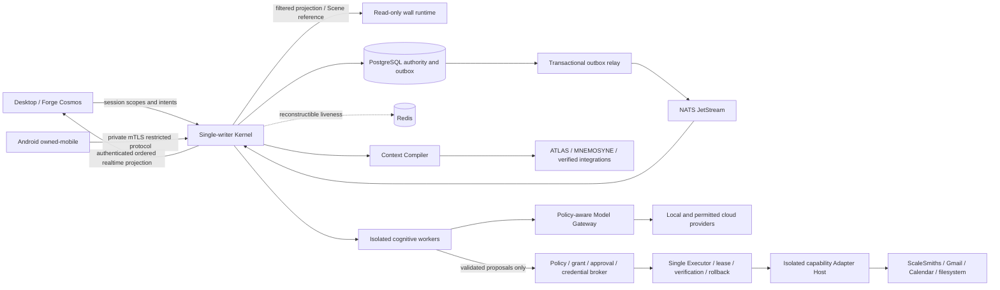

# Mark 42 system status

RTC follow-up on 3 October 2026: trusted desktop LiveKit/WebRTC is implemented
and running. Both local Windows speech and explicitly selected cloud speech
passed real media round trips using labelled synthetic speech, with a returned
audio RMS acceptance threshold. Physical microphone/AEC testing remains
unverified. The earlier integration snapshot below is preserved; RTC deferral
claims in that snapshot are superseded by [RTC_RUNTIME.md](RTC_RUNTIME.md).
Follow-up repaired an asynchronous agent-worker completion race exposed by
repeat local speech tests. Both speech paths then passed again; an independent
live logout test disconnected media in 869 ms. Exact commands and the hardware
and media-token limitations are documented in the RTC runtime report.

Qualification date: 3 October 2026. This report describes the working tree, including earlier uncommitted work. It is not an exact-release-SHA certificate, a deployment approval, or a claim that every hardware scenario has passed.

Mark 42 has a persistent, event-driven Kernel with temporal knowledge, memory, provider-neutral cognition, isolated cognitive workers, permissioned capability execution, and realtime desktop/mobile/display projections. The integration phase makes the observed operating picture visible and removes misleading presentation values. The complete aspirational product statement is **not yet hardware-qualified**.

## Working implementation

- PostgreSQL owns state, event ledger/outbox, identity, sessions, approvals, invocation lifecycle, ATLAS, MNEMOSYNE, objectives and conversation history. NATS JetStream transports committed events; Redis is reconstructible and non-authoritative.
- The Model Gateway evaluates task, privacy, locality, budget, health and fallback. Cognitive worker completion and verified capability effects remain distinct. Agents cannot bypass the Executor or mint authority.
- The desktop subscribes to the authenticated Operating Picture. Forge Cosmos, Core, model rail, agent graph, telemetry, conversation, ScaleSmiths, execution and approvals share a restrained semantic palette. The graph uses observed jobs and recorded parent references, never the specialist roster as invented activity. Sound is opt-in and derives from observed state transitions; reduced-motion mode also suppresses sound.
- Narrow arithmetic requests select ORACLE's extraction task; reasoning selects ORACLE reasoning; repository requests select FORGE/code. Explicit requested routes remain explicit. This classifier selects intent, never grants permission. Gateway eligibility and privacy remain independent controls.
- Conversation, business-source provenance and actual invocation states are exposed read-only. Approval controls disable on disconnect. Stream data revalidates credentials and principal ownership on every delivery, with an ordered bounded queue.
- Mobile remains `owned-mobile`, local analysis-only and cloud-disabled. Wall projections are read-oriented and omit transcripts/private business values/approval secrets. “Put that on the wall” presents a canonical Scene reference, not copied authority. Notification selection considers owner, trust, availability, presence evidence, urgency and mode.

## Truth audit

| Visible information | Source and limits |
| --- | --- |
| Time | Local device clock; not server synchronisation proof |
| Core mode, work, interaction | Kernel Operating Picture; connection failure overlays unavailable/stale |
| Objective | Kernel objective/state references; hardcoded zero progress removed; no percentage without an observed value |
| Dependency/node counts | Diagnostics health probes and admitted node references; fixed workstation/server topology removed |
| Model identity, candidates, fallback | Persisted Gateway attempt observations correlated to actual requests |
| Context units and estimated cost | Provider/adapter accounting; explicitly abstract units/estimate, not actual billing or token counts |
| Input/output/cached tokens, first token, throughput | Provider-reported fields only; missing observations remain unavailable |
| Agent stages, parent links, budgets | Durable jobs, leases, confirmed worker state and linked Executor records; unconfirmed activity labelled |
| Capability completion | Executor lifecycle and verification outcome; cognitive COMPLETE is not execution COMPLETE |
| ScaleSmiths values | Principal-bound verified reads with status, observation timestamp and invocation/source references; objects are not converted into invented totals |
| Telemetry charts | Timestamped host/exporter/SQL samples; missing samples are gaps; disconnected/stale samples are unavailable |
| Vision diagnostics | Local perception observations; confidence is reported inference confidence, not proof of correctness |
| Conversation | Persisted Kernel cognition results; projection bodies are bounded and identified as recorded observations |
| Forge geometry | Artistic presentation driven by observed state; seeded star/particle positions are not metrics, entities or live neural activity |

Removed fixed chart-like traces, legacy decorative grid/axes, fabricated objective progress and assumed topology. DEMO MODE carries a persistent **SYNTHETIC SCENE / NO LIVE EXECUTION** banner and cannot submit Kernel commands. Test provider answers identify themselves as qualification fixtures.

## Interaction qualification

| Requested scenario | Evidence boundary |
| --- | --- |
| Morning brief | Business integration exercises verified Gmail/Calendar/ScaleSmiths fixtures through Executor and ingestion. The situation response adds principal-owned objectives/notifications, measured Kernel health and restricted ATLAS/MNEMOSYNE context, with missing-source limits. The composition passed integration; live account data and spoken delivery remain unqualified. Deterministic NOVA reads do not animate fictional model work. |
| Model routing | Intent selection unit-tested; isolated rig exercises extraction, reasoning, engineering and observed provider fallback using real Kernel/workers/Gateway/HTTP adapter. Model output is controlled, not a cloud/local LLM quality test. |
| Check production | The exact natural-language request selects deterministic Sentinel measured telemetry, explicitly scopes evidence to configured host/exporters and reports unknown remote coverage. This integration passed without model calls or fabricated repair proposals. Argus review remains a bounded proposal path. Real production endpoint/exporter coverage is unqualified. |
| “What’s wrong with that?” | Selected Scene/screen/gesture referent and privacy gates have integration coverage. Real camera/gesture/voice/model composition remains hardware-unverified. |
| Coding repair | Isolated worker/LABS proposal and agency paths are tested. A full repository repair → test execution → reviewable PR scenario is not qualified against a real engineering model. No production repair was performed. |
| HIGH approval | Approval, stale nonce/version/replay rejection and Executor verification are exercised in disposable fixtures. UI shows pending approvals and actual invocation states; it does not manufacture all intermediate frames or map rollback/failure to COMPLETE. |
| Revocation | Real mTLS node/session revocation plus per-delivery desktop stream rejection. Cross-principal projection tests fail closed. |
| Infrastructure failure | Real NATS outage beneath Kernel, recovery, outbox drain and duplicate checks. Added live Kernel Redis/PostgreSQL fault tests use only task-owned disposable containers. PostgreSQL health probe precedes database-dependent maintenance. During DB loss, durable commands fail and projections cannot claim freshness. |
| Provider failure | Real Gateway fallback logic and HTTP 503 in the labelled rig; rail exposes PRIMARY UNAVAILABLE → FALLBACK SELECTED only with an observed fallback reason. External provider outages remain untested. |
| Cloud offline | Rig runs with cloud disabled. Local fixture routes, canonical reads, Kernel state and policy remain available. Provider-unavailability integration rejects inference with safe HTTP 503 and an explicit unavailable message, records the failed run, and still reads canonical Sentinel telemetry without model calls. Without a configured real local model, inference is unavailable; privacy is never downgraded to make a cloud route work. |

## Hardware and simulation

`pnpm hardware:validate` detected this host's microphone, speakers, camera devices and one active 1536×864 monitor. That is enumeration, **not capability qualification**. Audible speech, wake word, microphone transcription, acoustic barge-in/echo, physical hand tracking, Air Touch, multi-monitor continuity, Android KeyChain/tunnel/audio/Bluetooth/battery behavior and a separate wall machine remain unverified. The Android debug APK has prior build/lint evidence in [COMPANION_VERIFICATION.md](COMPANION_VERIFICATION.md); Android has not been installed during this phase.

Headless Chromium did render the production export through `ANGLE / Qualcomm Adreno X1-45 / Direct3D11`. Windows GPU Engine counters observed its agent-browser process tree. This qualifies browser rendering on this host, not native Tauri rendering, physical perception or aggregate GPU utilisation. GPU counter measurements remain qualification artifacts; the live telemetry rail still says unavailable without a configured authoritative GPU exporter.

Integration model/provider/account responses are controlled fixtures. In-process event bus tests are identified separately from real NATS tests. Browser DEMO MODE and preview fixtures are labelled. No business revenue, meetings, incidents, tokens, GPU usage or provider latency is invented to fill a screen.

Planned/unqualified work includes physical-device qualification, real provider/account provisioning, live production telemetry coverage, complete end-to-end morning/coding/perception workflows, robust wake word on Android, durable notification queue/batches and production deployment qualification.

## Architecture



## Deployment topology

The supported development topology is one host: Core diagnostics/desktop HTTP on loopback `7420`, Model Gateway on its configured private loopback listener, PostgreSQL/NATS/Redis from `infrastructure/docker/local-server.compose.yml`, optional observability exporters, Next/Tauri desktop, local voice/vision processes, and separately enrolled Node Protocol runtimes. mTLS Node Protocol port and certificate paths are operator-configured. Wall runtime defaults to loopback `7423`; preview `7424` is fixture-only. Android reaches the private node endpoint through an operator-managed tunnel with matching certificate hostname. No public/LAN listener, production migration, cloud credential provisioning or two-host deployment is certified here.

The qualification rig uses disposable PostgreSQL, real Kernel/HTTP/WebSocket and a labelled HTTP model provider, with an in-process bus and no cloud access. It never attaches to a production database or account. `--serve` keeps the rig running for browser checks; its signal handler requests database cleanup. A forcibly terminated Windows process may require removal of its exact task-owned container; the integration launcher also sweeps disposable test prefixes.

Logical integration databases use a 512 MiB tmpfs to avoid Docker Desktop virtual-disk startup stalls, with PostgreSQL commit/fsync settings unchanged. They prove database transactions and reconstruction while the container lives, **not physical disk crash durability**. PostgreSQL restart fault injection and the backup/restore drill use disk-backed containers. This host's Docker VM has approximately 2.9 GiB RAM; qualification runs should be sequential and should not share an external database.

## Security posture and limitations

Scoped, session/node/certificate/epoch-bound access; nonce/version/expiry-bound approvals; strong trusted-surface enforcement; least-privilege mobile/display scopes; immutable command identity and durable deduplication; provider privacy/locality checks; bounded worker budgets/leases; structured model validation and proposal taint; credential broker and isolated adapters; stale/revoked/cross-principal rejection. Existing adversarial gates cover authority, injection, grants, credentials, replay and isolation; this phase adds per-delivery revocation and ownership tests.

Desktop invocation/model/job/objective queries and pending approvals/sessions are principal-filtered. HTTP snapshot reads and each queued stream delivery check the active projection owner. Stream queues are ordered and bounded at 128 updates; revocation does not wait for the periodic heartbeat before an update. Known model errors expose a fixed availability message and enum code, never raw provider exception text. State mutation append observers run after the database transaction commits; the committed-state visibility assertion is load-bearing.

Remaining architectural limits: ingress strong authentication is asserted by the local bootstrap flow, not MFA; caller privacy classification is not a content-aware detector; legacy desktop bootstrap environment variables are development-only and must not contain production secrets in a static web export; localhost diagnostics/state are not full authenticated remote surfaces; verification can read via the same adapter it checks; hashes are deterministic embedding features, not semantic neural embeddings; notification queue/batches do not survive restart; hardware/provider/production access qualification is incomplete. These are not removed by passing unit tests.

## Performance evidence and budgets

Raw measurements belong in `artifacts/mark42/runtime-qualification.json` and `artifacts/mark42/browser-performance.json`. They describe this ARM Windows host under local qualification load, not a workstation GPU, real LLM, or device guarantee. Event-to-projection timing includes persistence, projection construction and WebSocket delivery; command-to-provider timing includes context/worker dispatch. Renderer FPS measures rendered frames, not monitor refresh. Missing first-token, GPU utilisation, speech and Air Touch measurements remain null/unavailable. Budget recommendations must identify sample count, quality, fixture scope and hardware rather than extrapolate unavailable metrics.

| Measurement | Observed result | Local regression budget |
| --- | --- | --- |
| Committed state mutation → WebSocket projection | 10 samples across two rig runs, 22.4–43.3 ms | p95 ≤ 100 ms in this isolated rig |
| Operating Picture HTTP snapshot | 10 samples, 15.6–28.2 ms | p95 ≤ 75 ms in this isolated rig |
| HTTP cognition command → first provider request | 8 samples, 217.4–460.3 ms | p95 ≤ 750 ms with the same context/workers |
| Ambient rendered FPS | Production export: 19 samples / 10 seconds, 12.4–14.5 FPS, mean 13.3; MEDIUM low-power, headless Chromium, 1262×624 DPR 1 | mean ≥ 12 FPS, idle cap ≤ 15; not an active workstation target |
| Active rendered FPS | Latest production/counter run: 8 samples during observed WAITING/ROUTING/THINKING, 18.0–40.0 FPS, mean 32.1; AUTO transitioned HIGH/MEDIUM, one held fixture request | mean ≥ 30 FPS under this qualification load; not a native GPU guarantee |
| Core response proxy | Latest run: 6 DOM state transitions → next browser animation frame, 0.5–10.4 ms | proxy p95 ≤ 50 ms; actual GPU animation/scanout latency not qualified |
| Kernel memory | Latest rig RSS 258.5 MiB, JS heap used 44.1 MiB at completion | RSS ≤ 300 MiB for this four-request fixture; not a soak/leak budget |
| Browser JS memory | Production heap used 12.4 MiB ambient / 14.0 MiB after latest active request | used heap ≤ 50 MiB for this short scene |
| Browser process memory | Headless process-tree summed working sets: 885.1 MiB idle / 945.0 MiB active; private commit: 448.2 / 507.4 MiB | working-set sum ≤ 1.1 GiB and private commit ≤ 600 MiB in this short session; working sets can double-count shared pages, not unique app RAM |
| GPU 3D engine | Windows counters, 10 one-second readings each: idle 5.7–6.4%, mean 6.0%; active command window 5.3–24.5%, mean 11.8% | owned-browser 3D engine idle mean ≤ 10%, active window peak ≤ 35%; not total adapter utilisation |
| Model first token, aggregate GPU load, speech, Air Touch | Not measured | No credible budget yet; requires actual provider/exporter/device evidence |

These are initial regression thresholds with headroom over measured maxima, not guarantees or statistically established service objectives. The two tabulated transport runs are `runtime-qualification-baseline.json` and `runtime-qualification-measured.json`; the last browser setup run is `runtime-qualification.json`. Active renderer/Core proxy observations are `browser-performance-active.json`. Earlier dev-renderer observations remain `browser-performance-dev.json` (106.8 MiB JS heap), separate from the production export. The HTTP fixture intentionally waits 350 ms; answer completion time is not model first-token time. `node scripts/measure-mark42-browser.mjs --production` samples the open production export without reading credentials; `--active` submits a labelled renderer qualification request with a controlled four-second fixture hold.

GPU readings are `gpu-performance-idle.json` and `gpu-performance-active.json`. The active window includes startup and completion; timestamps allow correlation with browser state. An earlier renderer-only active window averaged 40.1 FPS; the later counter/reload window averaged 32.1 FPS, so the budget uses the observed lower run. Summed browser process memory is much larger than its JS heap; this phase does not establish a long-running leak/soak result or a native desktop memory budget.

Browser checks observed LIVE routing/fallback, a complete UI-submitted fixture request, correctly centred Core geometry/readout, scaled Scene panels, and explicit UNAVAILABLE/stale presentation during connection setup and after stopping the real fixture Kernel. The final disconnect check verified unavailable header modes, LAST OBSERVED panels, unavailable infrastructure counts and disabled commands. Screenshots are `desktop-production-final.png`, `desktop-disconnected-final.png` and `model-fallback-production.png`. These are headless Chromium checks, not native window/hardware qualification. The desktop Scene uses a 1920×1080 virtual layout; that is not a measured physical display size. Physical monitor/gesture calibration remains unqualified.

## Exact verification commands and results

Final local gate results for this working tree are below. These do not certify a release SHA, external accounts, hardware behavior or deployment.

| Command | Final result | Verification boundary |
| --- | --- | --- |
| `pnpm verify` | PASS: typecheck, lint, 79 unit suites / 347 tests | Lint is strict TypeScript plus structural/capability lint, not ESLint. Latest UI adjustments additionally passed production build type validation. |
| `pnpm test:integration` | PASS: 23 suites / 120 tests, 0 skipped, 516.68 s | Fresh `artifacts/mark42/integration-gate.json`; includes real dependency loss/recovery and real mTLS, with labelled model/account/perception fixtures. Launcher rejects skipped/missing/stale evidence. |
| `pnpm test:contract` | PASS: 4 suites / 16 tests | Shared message/schema contracts |
| `pnpm test:security` | PASS: 3 suites / 30 tests | Adversarial authority, credentials, replay, isolation, boundaries; latest ingress errors included in the integration gate |
| `pnpm fitness` | PASS: 2 suites / 17 tests | Import/authority/process ownership boundaries |
| `pnpm test:chaos` | PASS: 2 suites / 13 tests | 10 deterministic failure tests plus 3 host fault-mechanism tests; Kernel recovery proof comes from integration, not this gate alone |
| `pnpm backup:drill` | PASS: 16 migrations, dump/restore invariants, restored Kernel boot, completed invocation not re-executed | Disposable disk-backed database; not a production backup or disaster rehearsal |
| `pnpm build:desktop` | PASS: static production export / 5 generated pages; main route 64.5 kB, first-load JS 167 kB | Browser/export proof; native Tauri packaging is not newly qualified |
| `pnpm hardware:validate` | Exit 0 / device enumeration | Validator voice/vision/display capabilities remain NOT_TESTED; GPU browser rendering was separately observed |
| `pnpm exec tsx scripts/qualify-mark42.ts --serve` | PASS: four observed route cases and transport measurements | Real Kernel, HTTP adapter, PostgreSQL and WebSocket; fixture inference, no cloud |

Failures were retained rather than counted as passes. The initial full integration run had 83 passes, 4 failures and 29 skips after Docker daemon loss and continuity/state failures. A focused retry had 14 passes, 1 failure and 2 skipped tests (database readiness and an incorrect critical-issue assertion). The next full retry had 118 passes / 1 premature recovery assertion; its JSON remains `integration-retry-before-recovery-wait.json`. After the test waited for actual critical event-fabric recovery, the standalone dependency test passed 2/2 and the final full gate passed 120/120. The first backup drill failed database readiness; its final retry used a bounded 180-second startup deadline and passed. No infrastructure failure or skipped suite is certified green.

A final stale-panel label edit initially failed compilation because of a quote typo; the corrected edit passed fresh production build and `pnpm lint` (strict typecheck included). The final desktop client unit gate passed 347/347. Disposable qualification containers, servers and browser were stopped; the user's existing stack was not restarted or modified for the fault tests.

```powershell
pnpm verify
pnpm test:integration
pnpm test:contract
pnpm test:security
pnpm fitness
pnpm test:chaos
pnpm backup:drill
pnpm build:desktop
pnpm hardware:validate
pnpm exec tsx scripts/qualify-mark42.ts --serve
# In another terminal, after build:desktop:
node scripts/serve-mark42-export.mjs
npx --yes agent-browser open http://127.0.0.1:7426
node scripts/measure-mark42-browser.mjs --production
node scripts/measure-mark42-browser.mjs --production --active
# GPU idle; for active, run the second line concurrently with the browser --active command:
./scripts/measure-mark42-gpu.ps1 -Phase idle
./scripts/measure-mark42-gpu.ps1 -Phase active
$env:JARVIS_IT = '1'
pnpm exec vitest run apps/core/test/mark42-dependency-recovery.integration.test.ts
Remove-Item Env:JARVIS_IT
```

The aggregate `pnpm verify:full` chains typecheck, lint, unit, integration, contract, security, fitness, chaos, backup drill and desktop build. This phase records those commands individually, including failures and retries. Earlier release-audit totals are historical and do not certify this working tree.
