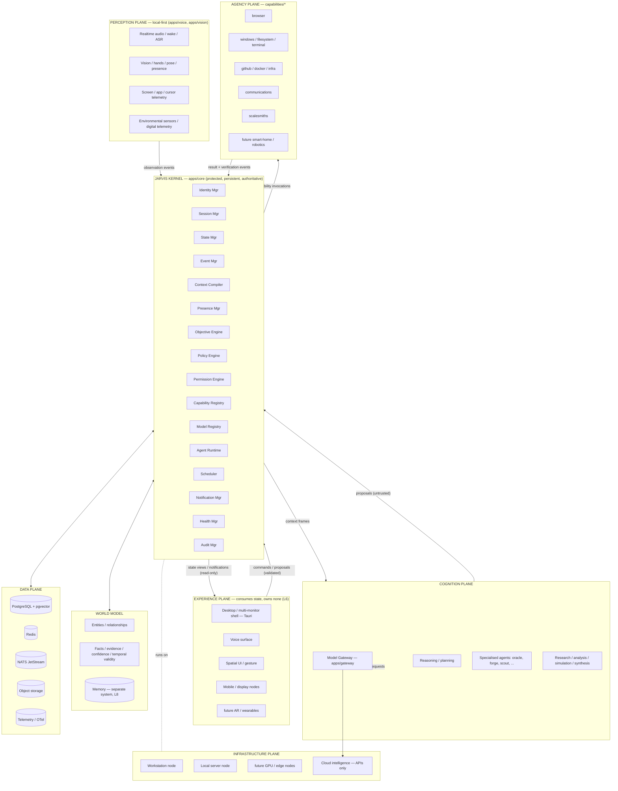
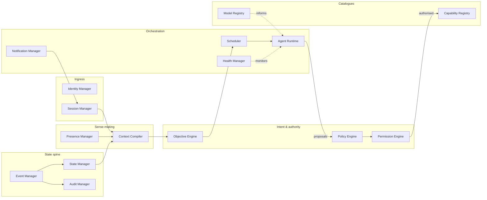
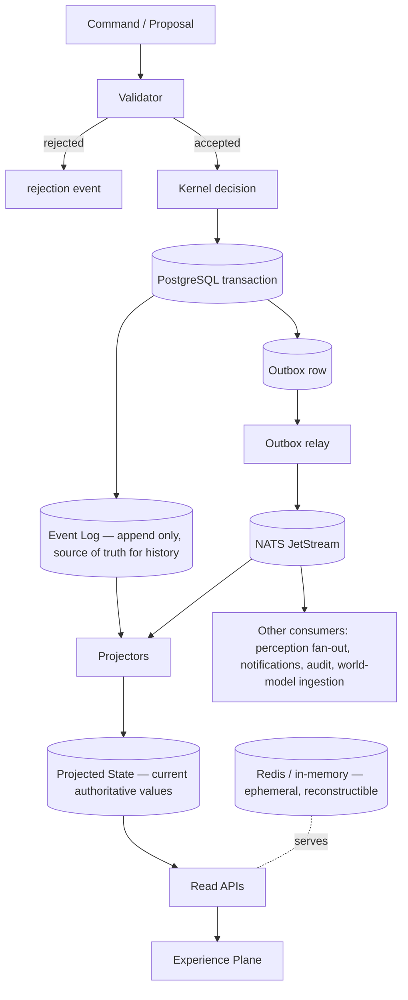
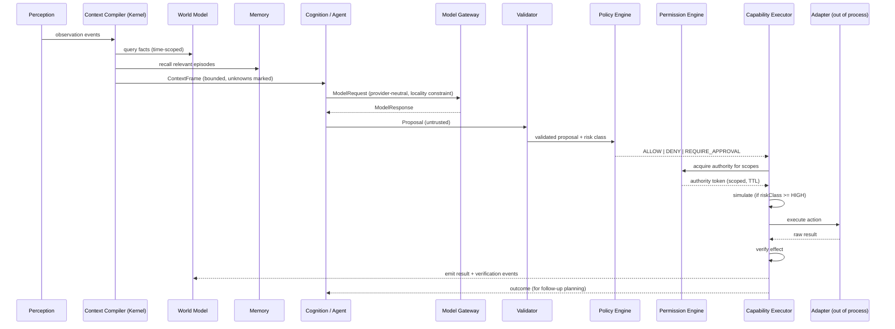
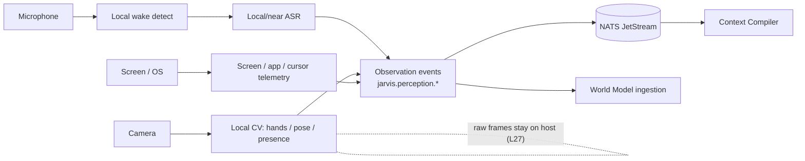
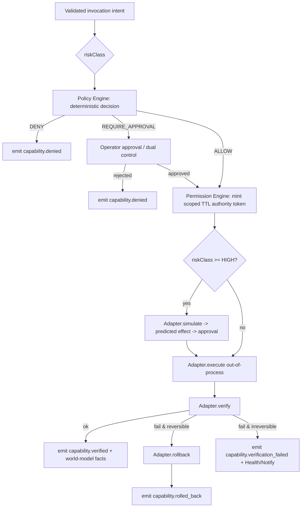
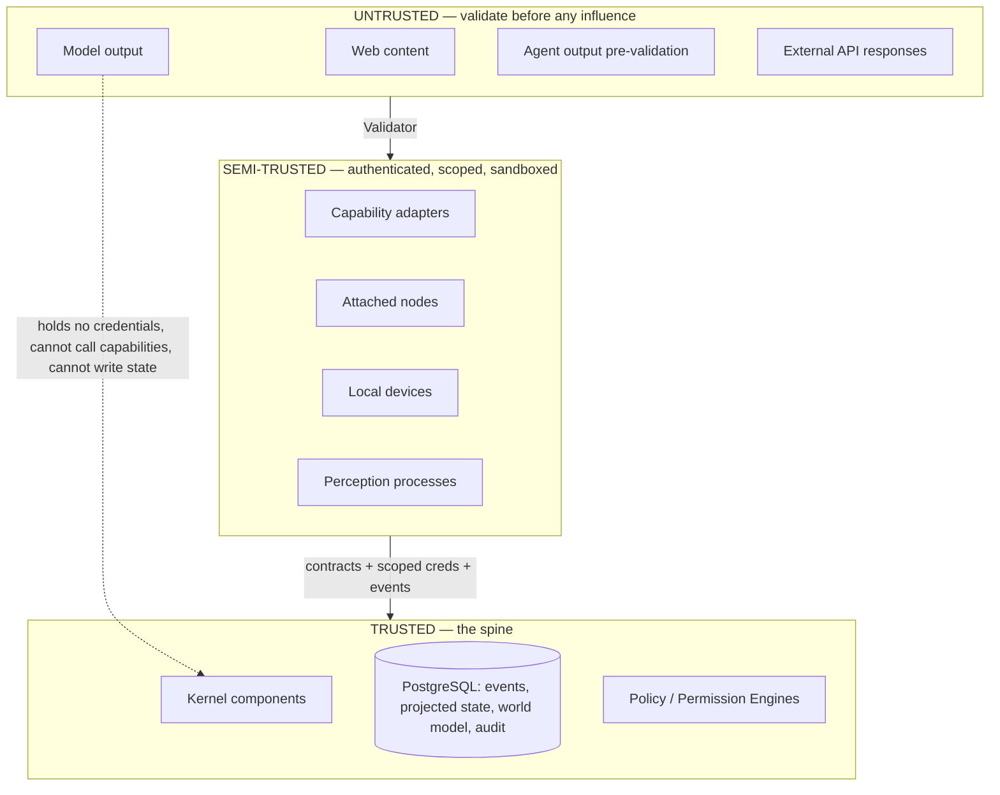
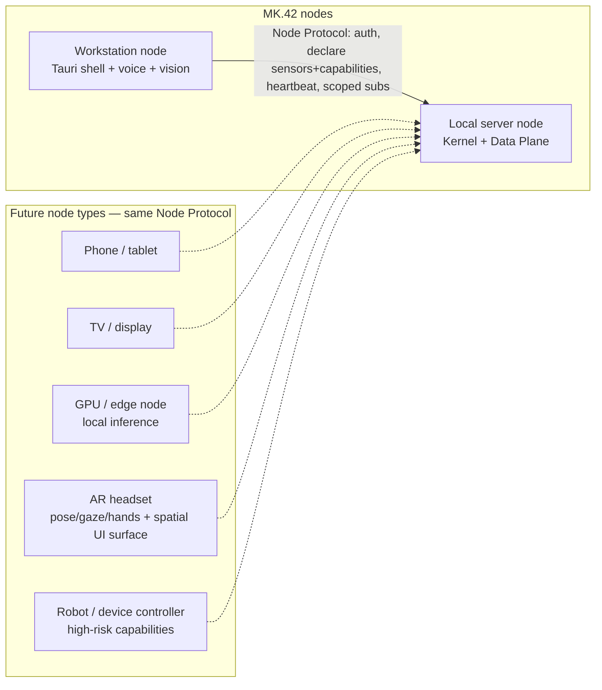

# JARVIS MK.42 — System Architecture

Status: **GENESIS / ratified foundation.** Supersedes nothing (first version).
Subordinate to [`PRINCIPLES.md`](PRINCIPLES.md).

This document is the single place a senior engineer can read to understand the
whole of JARVIS: what it is, what it is not, where intelligence lives, where
authority lives, how state and events work, how memory differs from the World
Model, how capabilities and permissions work, how providers are replaced, how
devices and future AR/robotics attach, and how the project evolves past MK.42.

---

## 1. What JARVIS is

JARVIS is a **persistent, event-driven operating layer** for artificial
intelligence. It is the durable spine around a set of replaceable cognitive
resources.

It consists of: identity, persistent state, event processing, context, memory,
world modelling, objectives, policies, permissions, capability management,
model routing, agent orchestration, perception, spatial intelligence,
planning, simulation, execution, verification, auditing, interfaces, and
distributed nodes.

The defining premise:

> JARVIS is a persistent, event-driven artificial intelligence operating layer
> that maintains a temporal model of the world, coordinates specialised
> intelligence, perceives through distributed sensors, executes actions
> through permissioned capabilities, remembers experience, manages persistent
> objectives, understands digital and physical context, and presents one
> consistent intelligence across all connected devices.

## 2. What JARVIS is not

| Not | Because |
|---|---|
| An LLM | Models are entries in the Model Registry, reached only through the Model Gateway (L1). The Kernel has no model SDK dependency. |
| A chatbot | Conversation is one Experience-Plane surface over persistent state (L2, L6). The system runs, perceives, and pursues objectives with no conversation open. |
| An LLM wrapper | The gateway is ~2% of the system. The other 98% — state, events, world model, policy, capabilities, audit — is provider-agnostic. |
| A voice-command script | Intent is resolved by fusing voice, gaze, cursor, UI state, presence, and context (L33). Commands are `Proposal`s subject to policy. |
| A pile of agents | Agents are disposable, leased, stateless workers (L9, L10). Orchestration, memory, and authority live in the Kernel, not in the agents. |
| OpenAI / Anthropic / Gemini / local models / TTS / CV / coding agents | All replaceable cognitive resources. None is part of JARVIS's identity (L3, L26). |

## 3. Where intelligence lives, where authority lives

These are deliberately different places.

- **Intelligence** (reasoning, planning, synthesis, perception inference) lives
  in the **Cognition Plane** and **Perception Plane** — replaceable, untrusted
  until validated, credential-free.
- **Authority** (what is true, what is permitted, what has happened, what will
  happen) lives in the **Kernel** — persistent, protected, deterministic where
  possible, the sole writer of authoritative state.

Cognition *recommends*. The Kernel *decides and records*. An LLM can propose a
policy outcome; it can never be the policy outcome (L21).

## 4. The seven planes



### 4.1 Experience Plane
Every surface a principal perceives JARVIS through. Desktop shell
(`apps/desktop`, Tauri), multi-monitor UI, voice, spatial UI, gesture, mobile,
TV/display nodes, future AR, future wearables. **Consumes state, owns none
(L6).** Interfaces submit `Command`s / `Proposal`s; they never write an
authoritative store. Detailed in `SYSTEM_BOUNDARIES.md` §Experience.

### 4.2 Kernel
`apps/core`, a NestJS modular monolith. The 16 components listed above are the
**frozen set** — see `KERNEL_CONSTITUTION.md`. The Kernel is the only writer of
authoritative state, the only caller of the Capability Executor, and the only
component that decides policy. It runs and makes decisions with **zero cloud
reachability** (degraded, not dead).

### 4.3 Perception Plane
`apps/voice`, `apps/vision`, plus screen/app/cursor telemetry collectors. Turns
sensors into `Observation` events. **Never reasons. Never calls a model for
reasoning. Never writes the World Model.** (L7). Local-first: continuous camera
and microphone streams stay on-host by default (L25, L27). Detailed in
`PERCEPTION_MODEL.md`.

### 4.4 Cognition Plane
The Model Gateway (`apps/gateway`, separate process), reasoning/planning,
specialised agents (`agents/*`), and research/analysis/simulation/synthesis.
Consumes `ContextFrame`s, produces `Proposal`s. **Holds no credentials for
authoritative stores or capabilities. Causes no effects.** Every provider is an
adapter behind the gateway (L3). Detailed in `COGNITION_MODEL.md`.

### 4.5 World Model
`packages/world-model` — entities, relationships, observations rolled into
facts, evidence, confidence, temporal validity; locations, projects, people,
devices, businesses (including **ScaleSmiths** as a first-class business
domain), software, infrastructure. **Memory is a separate system** (L8),
`packages/memory` — episodes, summaries, embeddings for recall. Detailed in
`WORLD_MODEL.md` and `STATE_MODEL.md` §Memory.

### 4.6 Agency Plane
`capabilities/*` — tools, browser, filesystem, terminal, OS, GitHub, Docker,
infrastructure, communications, ScaleSmiths integrations, future smart devices,
future robotics. Every consequential action is a capability invocation through
the single Executor pipeline (L18–L24). Adapters run out-of-process. Detailed
in `AGENCY_MODEL.md`.

### 4.7 Data Plane
PostgreSQL (+ pgvector), Redis, NATS JetStream, object storage, telemetry.
PostgreSQL is the authority behind everything; Redis caches only reconstructible
data; NATS is transport. Detailed in `STATE_MODEL.md`, `EVENT_ARCHITECTURE.md`,
`DATA_OWNERSHIP.md`.

### 4.8 Infrastructure Plane
Workstation, local server, GPU, edge nodes, private infrastructure, cloud
intelligence, network. MK.42 runs on **workstation + local server** via Docker
Compose; cloud is APIs only. Detailed in `LOCALITY_MODEL.md`.

## 5. The Kernel components (map)



Each component's responsibility, owned state, and forbidden dependencies are in
`KERNEL_CONSTITUTION.md` and `SYSTEM_BOUNDARIES.md`.

## 6. State in one picture



- **Event Log** — append-only, PostgreSQL. History. Never rewritten.
- **Projected State** — materialised read models, PostgreSQL. Current values.
  Sole writer: State Manager (via projectors).
- **Ephemeral Runtime State** — Redis + memory. Presence, liveness, locks,
  caches. Never authoritative.
- **World Model** — separate PostgreSQL schema. Beliefs with provenance.
- **Memory** — pgvector. Experience for recall.

Event sourcing is applied **selectively** (see `STATE_MODEL.md` §Scope):
event-sourced for objectives, permission grants, capability executions, and
audit; CRUD-with-mandatory-event-emission for catalogue data (model
registrations, capability manifests, node descriptors). Full event sourcing
everywhere is rejected as premature for MK.42 while all extraction seams for it
are preserved.

## 7. Events in one picture

Canonical envelope (`packages/contracts/src/event.ts`):

```
Event {
  id            ULID
  type          "jarvis.<plane>.<domain>.<name>"
  schemaVersion integer
  time          RFC3339 (occurred-at)
  source        node + component id
  subject       the entity/aggregate this concerns
  actor         principal | agent(for-principal) | system | node
  provenance    Provenance
  causationId   the event/command that directly caused this
  correlationId the end-to-end interaction id
  payload       type-specific, schema-versioned
}
```

Transport: **NATS JetStream**. Durable ledger: **PostgreSQL `events`**. Writes
go to PostgreSQL first (transactional outbox), then relay to JetStream. All
consumers are **idempotent** keyed on `Event.id`. Ordering guarantees, subject
hierarchy, replay, and retention are in `EVENT_ARCHITECTURE.md`.

## 8. Cognition flow — how a thought becomes an action



Detailed in `COGNITION_MODEL.md` and `AGENCY_MODEL.md`.

## 9. Perception flow



Perception emits **only observations**. It does not conclude, route to
reasoning models, or write the World Model. `PERCEPTION_MODEL.md`.

## 10. Capability execution pipeline



`AGENCY_MODEL.md` and `SECURITY_MODEL.md`.

## 11. Trust boundaries



Model output, web content, and pre-validation agent output are **untrusted
input** (L30). A jailbroken model escalates to nothing because there is nothing
on its side of the boundary to escalate to. `SECURITY_MODEL.md`.

## 12. Nodes — how devices, AR, and robots attach



A new device is a new **node type** plus new **capability manifests** plus new
**observation types**. The Kernel does not change. `SYSTEM_BOUNDARIES.md`
§Nodes, `docs/protocols/node-protocol.md`.

## 13. How AI providers are replaced

1. All inference calls go through `apps/gateway` using the provider-neutral
   `ModelRequest`/`ModelResponse` contracts.
2. Each provider (OpenAI, Anthropic, Gemini, a local llama.cpp/vLLM endpoint)
   is a gateway **adapter** implementing one interface.
3. The **Model Registry** (Kernel) lists models with declared capabilities,
   context limits, cost, and locality. Routing selects by requirement, not by
   name.
4. Removing a provider: delete its adapter, remove its registry rows, adjust
   routing defaults. **No Kernel change. No contract change. No World Model,
   Memory, Policy, Capability, or Event change.**
5. The Kernel's identity, decisions, and authoritative state never referenced
   the provider in the first place (L1, L26).

## 14. How memory differs from the World Model

| | World Model | Memory |
|---|---|---|
| Question it answers | "What is true now, and why?" | "What past experience is relevant to now?" |
| Shape | Entities, typed facts, relationships, evidence graph | Episodes, summaries, embeddings |
| Guarantees | Provenance, confidence, temporal validity mandatory | Time bounds + source-event links; lossy-compressible |
| Writers | Kernel ingestion only (from observations + validated cognition) | Kernel memory service (from events + session outcomes) |
| Consistency | Strong for identity/relationships; eventual for derived facts | Eventual |
| Store | PostgreSQL `world_model` schema | PostgreSQL `memory` schema + pgvector |
| Failure impact | Reasoning loses grounding → lower confidence, still runs | Reasoning loses recall → more clarifying questions |

They are separate packages, schemas, and services and never write each other
(L8).

## 15. Evolution beyond MK.42

`ROADMAP.md` is authoritative. In brief: every distribution boundary is
**already a message boundary**; contracts are **versioned**; the Kernel
component set is **frozen by ADR**. MK.43+ adds nodes, capabilities, models,
agents, and Experience surfaces — it does not rewrite the spine. Extraction
seams (`packages/*` → services) are listed in `SYSTEM_BOUNDARIES.md` §Extraction.

---

## 16. Adversarial self-review

Performed against this architecture before ratification, per the GENESIS
mandate. Each finding lists the risk, the verdict, and the correction folded
into the documents.

### 16.1 Duplicate authority

- **Finding.** Presence appeared owned by both a "Presence Manager" and the
  Session Manager (sessions imply presence).
  **Verdict.** Real ambiguity.
  **Correction.** `DATA_OWNERSHIP.md`: Session Manager owns *session liveness*
  (is this surface connected); Presence Manager owns *principal/device
  presence* (is the human here, on which node), computed from session liveness
  **plus** perception observations. One reads the other; only Presence Manager
  writes presence projections.

- **Finding.** Both the World Model and Memory could plausibly store
  "conversation happened" facts.
  **Verdict.** Real overlap.
  **Correction.** `WORLD_MODEL.md` + `STATE_MODEL.md`: conversations are
  **episodes in Memory**. The World Model may hold *derived* facts extracted
  from a conversation (e.g. "principal prefers X"), each with `epistemicStatus:
  asserted|inferred` and `Evidence` pointing at the episode. The episode text
  is never duplicated into the World Model.

- **Finding.** Scheduler vs Objective Engine both "drive future work".
  **Verdict.** Minor.
  **Correction.** Objective Engine owns *what* should happen and *why*
  (objectives, their decomposition, success criteria). Scheduler owns *when*
  work runs (time/trigger → enqueue). Scheduler never decides intent.

### 16.2 Unclear ownership

- **Finding.** "Node state" — is it Kernel Projected State or Ephemeral?
  **Correction.** Split. **Node registry** (a node exists, its declared
  capabilities/sensors, its trust level, its owner) is Projected State,
  strongly consistent, owned by Presence/Node Manager. **Node liveness**
  (heartbeat, current RTT, current subscriptions) is Ephemeral (Redis).

- **Finding.** Who owns `correlationId` allocation?
  **Correction.** `EVENT_ARCHITECTURE.md`: the ingress component that first
  accepts an interaction (Session Manager for Experience input, Perception
  gateway for observation-triggered flows, Scheduler for timed flows) mints
  `correlationId`. Documented as a rule, not left to convention.

### 16.3 Unnecessary infrastructure

- **Finding.** LiveKit was in the technology list; MK.42 has one workstation
  and one local server on a LAN. A media SFU is not needed yet.
  **Verdict.** Premature.
  **Correction.** ADR-0012 records LiveKit/WebRTC as the **chosen direction**
  for multi-node realtime media, **deferred** to the first multi-device MK.
  MK.42 uses local capture + direct WebSocket to the Kernel. No LiveKit
  deployment in GENESIS. Seam preserved: perception already emits observations,
  not media, to the Kernel.

- **Finding.** Object storage (S3-compatible) for a single local server —
  overkill vs the filesystem?
  **Verdict.** Keep, cheaply. MinIO in Compose is one container and removes a
  future migration (screenshots, audio clips, model artefacts, agent
  work-products, exports). ADR-0013 records the low cost and the reversal path
  (filesystem adapter behind the same blob interface).

- **Finding.** Redis *and* NATS *and* PostgreSQL — three data systems for one
  box.
  **Verdict.** Justified, documented. PostgreSQL = authority + ledger; NATS =
  distribution/replay/backpressure that a DB poll cannot do well; Redis =
  sub-millisecond ephemeral + pub/sub for UI liveness. Each has a distinct job
  in `DATA_OWNERSHIP.md`. `FAILURE_MODEL.md` proves the Kernel survives losing
  NATS or Redis.

### 16.4 Excessive abstraction

- **Finding.** A generic "Resource" super-interface was drafted to unify
  models, capabilities, agents, and nodes ("replaceable cognitive resources").
  **Verdict.** An abstraction that hides complexity instead of controlling it —
  the four have different lifecycles, trust levels, and contracts.
  **Correction.** Dropped. Four explicit contracts: `Capability`, `Model*`,
  agent manifests, `NodeDescriptor`. They share only the `Provenance` and
  `Event` primitives.

- **Finding.** "Everything is CQRS + event-sourced."
  **Verdict.** Over-application; catalogue tables do not benefit and pay a
  read-model tax.
  **Correction.** Selective event sourcing, scope table in `STATE_MODEL.md`.

### 16.5 Premature distribution

- **Finding.** The original plane list reads like 20+ services.
  **Verdict.** Would produce agent/microservice spaghetti in GENESIS.
  **Correction.** ADR-0008: **modular monolith** for the Kernel (`apps/core`),
  with only three separate processes justified by *lifecycle* or *blast
  radius*: `gateway` (holds provider creds, slow network IO), `voice`,
  `vision` (realtime, local-only, crash-isolated). Everything else is an
  in-process Nest module with a documented extraction seam.

### 16.6 Provider coupling

- **Finding.** `ContextFrame` draft carried a `messages: {role, content}[]`
  field — an OpenAI/Anthropic chat shape leaking into a Kernel contract.
  **Verdict.** Coupling.
  **Correction.** `ContextFrame` is structured (`objectives`, `facts`,
  `observations`, `recall`, `unknowns`, `task`). The **gateway adapter**
  serialises it into whatever wire format a provider needs. The Kernel never
  speaks "chat".

- **Finding.** Token budgets expressed in a specific tokenizer's units.
  **Correction.** Budgets are abstract "context units" per `ModelRequest`; the
  adapter maps to the provider's tokenizer.

### 16.7 Agent authority

- **Finding.** Agents could emit events directly onto NATS in the draft.
  **Verdict.** Violates L10 — direct event emission is a form of state
  authorship.
  **Correction.** Agents return `Proposal`s / `Observation`s to the Agent
  Runtime over a control channel. The Runtime (Kernel) is what emits events,
  after validation. Agents have **no NATS publish credential**.

- **Finding.** Coding agent (`forge`) needs filesystem + terminal — looks like
  it needs its own authority.
  **Correction.** `forge` proposes capability invocations like any other
  cognition. `capabilities/filesystem` and `capabilities/terminal` execute
  them under policy, in a workspace scope. The agent gets results, not a shell.

### 16.8 Weak trust boundaries

- **Finding.** Web content fetched by `capabilities/web` or `browser` could
  reach a summariser model and then a `Proposal` without a marked boundary.
  **Correction.** `SECURITY_MODEL.md`: fetched content is tagged
  `trust: untrusted, origin: <url>` at capture. It may be summarised, but any
  `Proposal` whose evidence chain includes untrusted web content is marked
  `derivedFromUntrusted: true` and cannot auto-approve any action above
  `riskClass: LOW`.

- **Finding.** Node trust was binary.
  **Correction.** Node trust tiers: `kernel-local`, `owned-secure`,
  `owned-mobile`, `guest`. Capability scopes and observation acceptance vary by
  tier. In `SECURITY_MODEL.md`.

### 16.9 Security assumptions

- **Finding.** Approval workflows ("REQUIRE_APPROVAL") assumed the operator is
  always reachable.
  **Correction.** `FAILURE_MODEL.md`: if the operator is unreachable, a
  REQUIRE_APPROVAL action **fails closed** (queued, not executed) unless it
  carries a pre-authorised standing grant with explicit "may proceed without
  live approval" scope. No silent fallback to ALLOW.

- **Finding.** Simulation was assumed to be side-effect-free without
  enforcement.
  **Correction.** `AGENCY_MODEL.md`: `simulate` runs the adapter in a mode
  where the Executor injects a **read-only / dry-run credential scope**;
  adapters that cannot honour dry-run must declare `simulatable: false`, and
  the Executor then treats simulation as unavailable and escalates the
  approval requirement instead of pretending.

### 16.10 State races

- **Finding.** Two projectors updating the same read model; concurrent grant
  revocation vs capability execution.
  **Correction.** `STATE_MODEL.md`: (a) each read model has exactly one
  projector, single-writer; (b) the Executor re-checks the authority token
  against a **freshness barrier** — it reads the grant's current version inside
  the same transaction that records `capability.started`; a grant revoked
  before that point aborts the execution. Long-running actions hold a
  **revocable lease** and check it at each verifiable step.

- **Finding.** Objective status transitions from multiple sources.
  **Correction.** Objective Engine is the single writer of objective state;
  all transitions are commands to it, serialised per objective id.

### 16.11 Unbounded persistence

- **Finding.** "Every meaningful occurrence is an event" + append-only Event
  Log → unbounded growth, especially from high-frequency perception
  observations (cursor moves, pose frames).
  **Verdict.** Real; would swamp PostgreSQL within weeks.
  **Correction.** `EVENT_ARCHITECTURE.md` §Retention introduces **event
  classes**:
  - *Ledger events* (state changes, decisions, executions, grants, audit) —
    retained indefinitely, this is the authoritative history.
  - *Signal events* (raw perception observations) — retained in a rolling
    window (default 7 days) in a partitioned table, then dropped; anything
    durable must have been promoted to a World Model fact or a Memory episode
    with its own retention.
  - *Derived/notification events* — short TTL.
  Perception also **debounces and aggregates** before emitting (e.g. "cursor
  dwelled on element X for 3s", not 180 move events). `WORLD_MODEL.md` and
  `STATE_MODEL.md` define compaction for facts (supersede + archive) and
  Memory (summarise + decay).

- **Finding.** World Model facts never expire → contradictory history
  accumulates.
  **Correction.** Superseded facts move to a `facts_archive` partition after
  their `validTo`; the evidence graph is preserved but out of the hot query
  path.

### 16.12 Context explosion

- **Finding.** The Context Compiler pulling "all relevant facts + all relevant
  memories + all objectives" has no bound → cost blowup and degraded reasoning.
  **Verdict.** Real; the classic failure of this kind of system.
  **Correction.** `COGNITION_MODEL.md` §Context budget: every `ContextFrame`
  has a hard **context-unit budget** set by the task class and the target
  model's limit. The Compiler fills it by **priority tiers** (task statement →
  active objective → high-confidence directly-relevant facts → recent episodes
  → supporting facts) and **stops at the budget**, recording what was omitted
  in `ContextFrame.truncated`. Recall queries are `top-k` with a relevance
  floor. No unbounded joins. Cognition can request a follow-up frame for a
  narrowed sub-question rather than one giant frame.

### 16.13 Other corrections folded in

- **Kernel restart / cold start.** `FAILURE_MODEL.md`: the Kernel rebuilds
  Projected State by replaying the Event Log from the last projection
  checkpoint; Ephemeral State is discarded and rebuilt from live sessions and
  node re-registration. Target cold start < 10 s for MK.42 data volumes.
- **Partial capability execution.** `AGENCY_MODEL.md`: multi-step actions
  declare steps with per-step verification and compensation; a crash mid-action
  is detected on restart via the `capability.started` event with no matching
  terminal event, and the Executor runs the declared compensation.
- **Malformed model output.** Validator rejects → `cognition.output_rejected`
  event → bounded retry with a stricter instruction → fall back to a simpler
  model or to asking the principal. Never a crash, never a silent pass.
- **Multi-user readiness cost.** Confirmed cheap: `principalId` column + a
  policy predicate. No auth server, no tenant isolation infra in MK.42.

### 16.14 Result

The architecture as documented in this directory reflects all corrections
above. No open contradictions remain between `PRINCIPLES.md`, the model
documents, and the ADRs. Remaining *risks* (not defects) are tracked per-ADR
under "Risks" and in `ROADMAP.md`.
