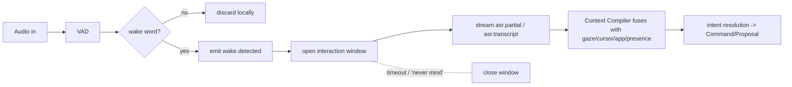

# Perception Model

Sensors become observations. Perception is separate from cognition (L7) and
local-first (L25, L27).

Subordinate to [`PRINCIPLES.md`](PRINCIPLES.md).

---

## 1. The wall between perception and cognition (L7)

| Perception may | Perception may not |
|---|---|
| Read sensors | Call a model for *reasoning* |
| Run local perception inference (wake word, ASR, pose, detection) | Draw interpretive conclusions ("the user is frustrated") |
| Debounce, aggregate, threshold | Write the World Model or Memory |
| Emit `Observation` events | Import `apps/gateway` client, `packages/agents`, or any Cognition package |
| Spool observations briefly if NATS is down | Transmit raw audio/video off-host (except via an explicit HIGH-risk capability) |

Enforced by package boundaries and lint rules: the `apps/voice` and
`apps/vision` packages have no dependency edge to cognition.

Perception emits **signals**, not judgements. "prosody.arousal = 0.8, conf
0.6" is allowed; "user is angry" is a cognition inference with its own
`epistemicStatus: inferred` and evidence.

## 2. Streams

| Stream | Runs on | Local inference | Emits (`jarvis.perception.*`, class: signal) |
|---|---|---|---|
| Realtime audio | workstation (`apps/voice`) | VAD, wake-word, ASR (whisper.cpp / equivalent), optional diarization, prosody features | `audio.vad`, `wake.detected`, `asr.partial`, `asr.transcript`, `audio.prosody` |
| Vision | workstation (`apps/vision`) | face/person presence, hands (MediaPipe), pose, gaze estimate (future), object/scene tags | `vision.person.present`, `vision.identity.hint`, `hands.gesture`, `pose.state`, `gaze.target` (future), `vision.scene.tags` |
| Screen / app / cursor | workstation collector | window/app focus, cursor position → dwell, selection, active document ref | `screen.window.focused`, `app.active`, `cursor.dwell`, `screen.selection`, `doc.active` |
| Environmental | any node with sensors | thresholding only | `env.<sensor>.<name>` (temp, light, presence PIR, etc.) |
| Digital telemetry | Kernel-adjacent collectors | — | `telemetry.<source>.<name>` (build status, calendar edge changes, inbox arrival — as signals) |

## 3. Wake & interaction lifecycle

Wake detection is **fully local and low-latency** (L25). No audio leaves the
host to decide whether JARVIS was addressed. The interaction window bounds how
long ASR streams; barge-in and cancellation close it.

## 4. Multimodal fusion (L33)

Intent is resolved from a **`ContextFrame`**, not one modality. The Context
Compiler fuses concurrent signals:

- "open **this**" + `gaze.target = fileX` + `cursor.dwell on fileX` →
  referent = fileX.
- voice command + `app.active = IDE` + `doc.active = repoY/fileZ` → scope the
  command to that file.
- gesture (`hands.gesture = point`) + `screen.selection` → operate on the
  selection.
- `vision.person.present = false` → suppress voice output, route to
  notification instead (Presence + Notification policy).

No single modality is authoritative; the fusion result carries a confidence and
cognition can ask to disambiguate.

## 5. Locality & privacy (L25, L27)

- Continuous camera and microphone streams **stay on the workstation**. The
  vision process emits derived observations (`person.present`,
  `gesture`, `scene.tags`) — never frames.
- Sending a specific frame or audio clip to cloud (e.g. "what is this object?"
  to a vision model) is an explicit **HIGH-risk capability invocation**
  (`capabilities/web` or a dedicated `vision.cloud-analyze`), per-instance,
  policy-gated, audited (L27, review §16 folds this in).
- Local perception models run on the workstation CPU/GPU. A future GPU node can
  host heavier models and publish the same observation types (L36).
- Privacy-sensitive derivations (identity hints, presence) are `principalId`
  scoped and subject to policy on retention.

## 6. Backpressure & failure (see `FAILURE_MODEL.md`)

- **NATS unreachable**: perception spools observations to a bounded local ring
  buffer (seconds–minutes), drops oldest signal data first, emits a
  `perception.degraded` marker on reconnect with the gap.
- **Sensor disappears** (webcam unplugged, mic removed): emit
  `perception.<stream>.lost`; the stream stops cleanly; Presence and cognition
  adjust (fall back to other modalities); reappearance emits `.restored`.
- **Local inference model fails to load / GPU unavailable**: fall back to a
  lighter local model or CPU; if none, emit `perception.<stream>.unavailable`
  and continue with remaining streams. Perception never crashes the workstation
  shell.
- Perception is **not** on the Kernel's critical path — the Kernel runs with
  zero observations coming in (it just has less context).

## 7. What perception must never do

- Reason, conclude, or interpret beyond thresholded signals.
- Call the Model Gateway or any agent.
- Write the World Model or Memory.
- Send raw media off-host outside an explicit HIGH-risk capability.
- Persist raw streams (only bounded local buffers; durable capture is a
  capability with its own policy).
- Block on the Kernel.
