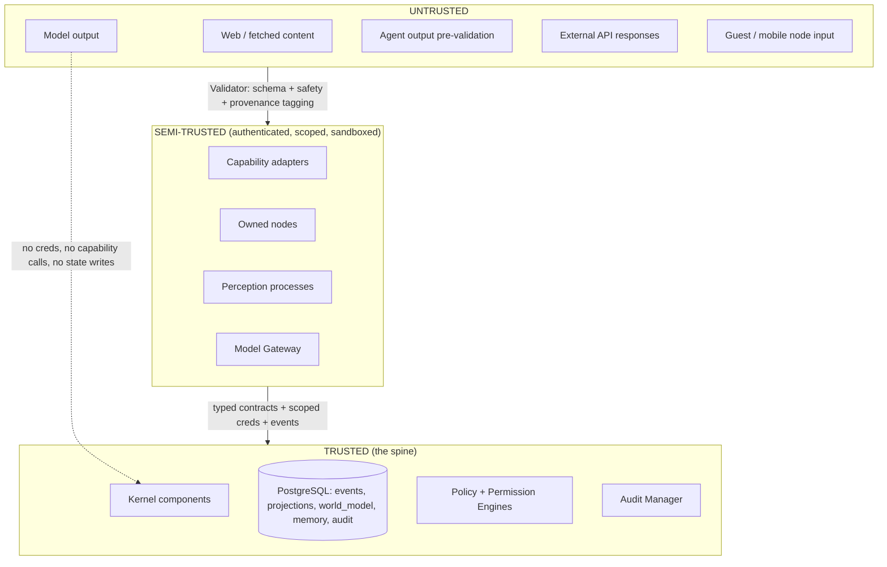

# Security Model

Security is architectural, not prompt-based (L30). This document defines trust
boundaries, the risk→authority tier table, structural prompt-injection defense,
credential partitioning, node trust tiers, approval semantics, and audit.

Subordinate to [`PRINCIPLES.md`](PRINCIPLES.md).

---

## 1. Core stance

- **No security control is a string in a prompt.** Not "you must not…", not "if
  the user asks for X, refuse". Those are advisory at best and defeated by
  injection.
- Security controls are: **process boundaries**, **credential scopes**, the
  **Validator**, the **deterministic Policy Engine**, the **Permission Engine**,
  and the **append-only audit trail**.
- **All model output, web content, and pre-validation agent output is untrusted
  input.** The system is designed so that a fully adversarial model gains
  nothing: it holds no credentials, cannot call capabilities, cannot write
  state, and can only emit `Proposal`s onto one validated channel.

## 2. Trust boundaries

| Boundary | Crossing control |
|---|---|
| Untrusted → Kernel | The **Validator**: schema check, safety check, evidence/trust tagging. Untrusted-derived data is marked and cannot justify actions > LOW. |
| Experience → Kernel | Per-surface auth; only `Command`/`Proposal` envelopes; validated; no store access. |
| Perception → Kernel | Authenticated process; only `Observation` events; signal-class; cannot reason. |
| Cognition/Gateway → Kernel | Only `Proposal`/`ModelResponse` contracts; validated; gateway holds provider keys and nothing else. |
| Agent → Kernel | Only via Agent Runtime control channel; agent holds no credentials; Runtime emits events after validation. |
| Adapter → world | Scoped resource credential only; via Executor only; `verify` mandatory. |
| Node → Kernel | Node Protocol: mutual auth, declared trust tier, scoped subscriptions and capability scopes. |
| Kernel → provider | Only through the gateway; provider-neutral contract; content not persisted by default. |

## 3. Risk class → authority tier table (L19)

| riskClass | Reversible? | Simulate first | Authority required | Operator-unreachable behaviour |
|---|---|---|---|---|
| **AMBIENT** | n/a (read) | no | standing ambient grant | proceed (reads only) |
| **LOW** | n/a (read) | no | standing grant with scope | proceed |
| **MEDIUM** | usually | no | standing grant with scope + post-hoc notify | proceed, notify |
| **HIGH** | preferably | **yes** (or escalate) | live approval **OR** explicit standing grant scope `mayProceedWithoutLiveApproval` | **fail closed** — queue, do not execute |
| **CRITICAL** | rarely | **always** | **dual control**: operator approval + explicit typed confirmation; never auto | **fail closed** |

- Determinism (L20): the Policy Engine computes the decision as a pure function
  of typed inputs — no network, no model, no clock-dependent branching beyond
  explicit time-window rules. Same inputs ⇒ same decision, always.
- An LLM `PolicyRecommendation` is admissible as **one typed input** to a rule
  (e.g. "if recommendation=DENY, then DENY"), but a rule can never be "return
  whatever the model said". The decision function does not call a model
  (L21). Rule validation **rejects** any rule that references
  `context.llmRecommendation` with an effect other than `DENY`.
- **Evaluation order** (ADR-0026): engine **hard caps** first —
  `derivedFromUntrusted` above `riskClass: LOW` ⇒ **DENY**;
  `requiredScopes ⊄ heldScopes` ⇒ **DENY**; `GUARDIAN` + `CRITICAL` ⇒
  **DENY** — none overridable by a rule. Then **rules** by priority (**DENY
  beats REQUIRE_APPROVAL beats ALLOW** at equal priority; first matching DENY
  wins). Then the **fail-closed default**: `AMBIENT` ⇒ ALLOW, `LOW` ⇒
  REQUIRE_APPROVAL, `MEDIUM`/`HIGH`/`CRITICAL` ⇒ DENY. An unconfigured system
  permits only ambient reads.
- **Mode and objective authority are restrict-only** policy inputs: a rule may
  branch on `jarvisMode` / `activeObjectiveGate` only to reach a *more*
  restrictive effect. `AUTONOMOUS` never converts `REQUIRE_APPROVAL` to
  `ALLOW` (ADR-0019).

## 4. Structural prompt-injection defense (ADR-0018)

Injection works by making a model emit attacker-chosen instructions. JARVIS
neutralises the *consequences*:

1. **The model side of the boundary holds nothing.** No API keys (gateway
   only), no DB access, no NATS publish, no capability handle. A perfectly
   jailbroken model can still only return text on one channel.
2. **Output is a `Proposal`, not an action.** Every proposed effect re-enters
   through the full Executor pipeline: Validator → Policy → Permission →
   simulate → execute → verify. Injection cannot skip any stage.
3. **Provenance-tainting.** Content fetched from the web / external APIs is
   tagged `trust: untrusted, origin: <url>` at capture. Any `Proposal` whose
   evidence chain includes untrusted content carries
   `derivedFromUntrusted: true`; policy forbids it from alone justifying an
   action above `riskClass: LOW`, and forbids it from being written as a
   `world_model` fact with `epistemicStatus` stronger than `retrieved`.
4. **No instruction channel from content to Kernel.** The Kernel never
   interprets model/agent free text as a command. Only typed
   `Command`/`Proposal` fields with schemas are acted on.
5. **Deterministic policy.** Even a `Proposal` that passes schema validation
   hits deterministic rules the model cannot see or influence.
6. **Agents cannot self-escalate.** Capability scope is set by the Agent
   Runtime at lease time; an agent asking for more gets a new lease decision,
   not a bigger scope.

Net: prompt injection can waste tokens and produce a rejected proposal. It
cannot move money, delete data, push code, or write a belief.

## 5. Credential partitioning

| Holder | Holds | Never holds |
|---|---|---|
| Kernel (`apps/core`) | PostgreSQL creds; NATS publish creds for ledger subjects; node-admission signing key | Provider API keys; adapter resource creds |
| **Credential Broker** (Kernel-internal service) | Adapter credential **material**, in memory only, loaded from OS keychain / a `0600` secrets file at startup; never written anywhere | DB write, NATS, an effect path — it only `mint`s |
| Model Gateway | Provider API keys (env / OS keychain) | DB, NATS, adapter creds |
| Each capability adapter worker | A per-invocation `CredentialHandle` from the Broker, scoped to `(capabilityId, action, resourceRef, mode)`, TTL ≤ invocation; for `derived` mints it never sees the secret string | DB, NATS, provider, other adapters' creds, `process.env` secrets, any standing credential |
| Agents | **nothing** | everything |
| Perception processes | Sensor device handles; a scoped NATS publish cred for `jarvis.perception.>` only | DB, provider, adapter creds |
| Experience surfaces | Per-surface session token (scoped read + command submit) | any store credential |

Secrets are **not** in PostgreSQL. They live in the OS keychain / a `0600`
secrets file, loaded **only** into the Credential Broker process. Adapters
receive per-invocation handles, not material; `derived` mints (GitHub
fine-grained token, AWS STS, signed Docker-proxy token) are redeemed through
`ctx.http` / a proxy so adapter code never touches the string. The
worker→Executor channel runs a redactor seeded with the secret fingerprint; a
hit ⇒ `«redacted»` + `jarvis.security.alert.elevated`. `agency.invocations`
stores `input_hash`, never `input`. (ADR-0025 §2, ADR-0030.)

## 6. Node trust tiers (review §16.8)

| Tier | Example | Observations accepted | Capability scopes allowed |
|---|---|---|---|
| `kernel-local` | the local server | all | all (subject to policy) |
| `owned-secure` | the workstation | all | up to HIGH; CRITICAL needs dual control at the Kernel |
| `owned-mobile` | the principal's phone | presence, location, voice intent | LOW/MEDIUM; HIGH only with live approval on a `kernel-local`/`owned-secure` surface |
| `guest` | a visitor's device, a shared display | none by default (opt-in per session) | AMBIENT read-only presentation surface only |

A node's tier is set at admission by the operator and stored in the durable
node registry. It cannot self-upgrade.

## 7. Approval & dual control

- **REQUIRE_APPROVAL** surfaces the request — with the simulated effect for
  `riskClass >= HIGH` (`simulatable` actions; a non-simulatable one surfaces
  "no simulation available") — to the operator on a trusted surface
  (`owned-secure` node, operator identity, `authTrustLevel >= trusted`).
  Actions: approve / reject / edit-then-approve (an edit re-enters Validator →
  Policy from the top).
- **Timeout** (default 15 min) **or operator unreachable** ⇒ **fail closed**
  (`expired` ⇒ `DENIED`, queued not executed) unless a standing grant carries
  `mayProceedWithoutLiveApproval` for a scope covering the action, recorded as
  `approvalEvidence.kind = 'standing-grant'` (review §16.9).
- **Dual control** (CRITICAL, `requiredAuthorisations = 2`): two distinct
  deliberate operator acts on a trusted surface — (1) an `approve` on the
  `ApprovalRequest`, **and** (2) a typed **confirmation phrase** matching the
  manifest's per-capability `confirmationPhrase`, submitted as a separate
  `Command` — from the **same `sessionId`**, at **`authTrustLevel: verified`**,
  both within the approval TTL. CRITICAL is **always** simulate-first. The
  phrase's hash is stored as `approvalEvidence`. True two-person control (two
  principals) is deferred to multi-user (ROADMAP MK.90+); the
  `requiredAuthorisations` field already carries it. (ADR-0027.)

## 8. Audit (L31)

- The Audit Manager derives an **append-only** trail from ledger events. Every
  policy decision, grant issue/revoke, capability invocation (all pipeline
  stages), model call (metadata), node admission, and objective transition is
  reconstructable with `provenance` and `correlationId`.
- Audit records are never mutated or deleted; old partitions move to cold
  storage while staying queryable.
- Diagnostics can answer, for any effect: who/what proposed it, which context
  and evidence, which policy rule fired, who approved, what was simulated, what
  was executed, what `verify` found, whether it was rolled back.

## 9. Data protection

- PostgreSQL and object storage encrypted at rest (disk / bucket level).
- All inter-node and node↔server traffic over TLS (mTLS for node↔Kernel).
- Continuous camera/mic never leaves the workstation (L27).
- `principalId` scoping on every personal record; retention policy per data
  class (`STATE_MODEL.md` §6).
- Provider calls: content not persisted by default; enabling content logging is
  a HIGH-risk capability.

## 10. Threat scenarios (see also `docs/security/threat-model.md`)

| Threat | Mitigation |
|---|---|
| Jailbroken / malicious model | §4. Model holds nothing; output is a gated proposal. |
| Prompt injection via fetched web page | §4.3 provenance-tainting; capped at LOW; not writable as strong belief. |
| Compromised capability adapter | Process isolation; scoped credential only; `verify` + audit catch anomalous effects; Executor lease limits blast radius. |
| Rogue / buggy agent | No credentials; Runtime-mediated; lease budget + wall-time caps; output validated. |
| Malicious guest node | `guest` tier accepts no observations, gets a presentation surface only. |
| Operator-unreachable exploited for auto-approve | Fail closed. No ALLOW fallback. |
| Replay of an old command | `commandId` dedupe; authority tokens TTL'd; freshness barrier on grants. |
| Exfiltration via cognition | Cognition can't call capabilities or the network; only the gateway egresses, and only to registered providers with metadata-only logging. Sending data out is a HIGH/CRITICAL capability. |
| State corruption via race | Single-writer projectors; freshness barrier; per-id serialisation (`STATE_MODEL.md` §5). |
| Confused deputy / capability privilege escalation | Authority token binds `principalId` + `invocationId`; Policy evaluates the *originating* actor's `heldScopes`; missing scope ⇒ DENY (never "ask"); the Executor holds no ambient authority. (threat-model T19, T20) |
| Forged ledger event advancing a plan | Only Kernel components hold the ledger-publish credential; `jarvis.agency.invocation.*` accepted only from the Executor `source`; the Orchestrator advances only on events it did not emit. (T21) |
| Adapter lies about success / verification | `verify` is Executor-run against the world via the manifest `verificationStrategy` under a read-only credential; the adapter return value never flips the state to `COMPLETED`. (T27) |
| Command injection into the shell adapter | `terminal` takes an argv array only — no shell, no `sh -c`, no interpolation; `argv[0]` must match the grant `command-allow`; HIGH minimum; simulate-first. (T24) |
| Malicious self-authored extension | Built/tested only in JARVIS LABS with synthetic creds; deterministic static + security-lint + dep-audit + egress gate; mandatory human review; registration operator-only; probation + Sentinel flag. (T23, ADR-0029) |

### Sentinel & Guardian

Detection is a **deterministic** Kernel-internal detector service
(`SENTINEL_MODEL.md`) — no offensive capability exists or can be registered
(active-intrusion verb denylist, enforced by the SDK + Registry +
`scripts/lint.mjs`). The `sentinel` specialist agent **proposes only**.
`high`/`critical` alerts may drive the deterministic mode transition to
`GUARDIAN`, whose **restrict-only** response playbook (tighten grants, suspend
autonomous external actions, lock CRITICAL, snapshot evidence, isolate a named
node, notify) runs **through the Executor pipeline** — Guardian mints no
authority, widens no grant, disables no audit, and is operator-reversible only.
