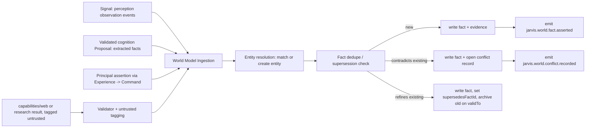

# World Model

> **Superseded by [`ATLAS_MODEL.md`](ATLAS_MODEL.md) (MK.46).** ATLAS is the
> implemented name for the World Model subsystem. This document is retained for
> historical context (the GENESIS sketch) and for the `world_model` → `atlas`
> schema rename recorded in [ADR-0020](adr/0020-knowledge-subsystem-boundary.md).

<details><summary>Historical GENESIS sketch</summary>

The current, structured, provenance-bearing model of the world. Answers "what
is true now, and why" (L8, L11–L17).

Subordinate to [`PRINCIPLES.md`](PRINCIPLES.md). Distinct from Memory
(`STATE_MODEL.md` §Memory, `COGNITION_MODEL.md`).

---

## 1. What it holds

Entities and their relationships and attributes, across domains:

- **People** — the principal, colleagues, contacts.
- **Locations** — rooms, buildings, sites; each may carry spatial extent
  (`packages/spatial`).
- **Projects** — including their status, participants, artefacts.
- **Devices / nodes** — the physical and virtual machines JARVIS runs on or
  talks to.
- **Software / infrastructure** — repos, services, deployments, environments.
- **Businesses** — **ScaleSmiths is a first-class business domain**: the
  business entity, its projects, its infrastructure, its people, its
  software, its external accounts. JARVIS models it and operates on its behalf
  through `capabilities/scalesmiths`.
- **Digital context objects** — applications, windows, documents currently
  relevant (short-lived entities, mostly attribute churn).

## 2. Core schema (`world_model` PostgreSQL schema)

```
entities
  id            ULID
  type          string        -- "person" | "location" | "project" | "device"
                              --   | "software" | "business" | "app_window" | ...
  canonicalName string
  principalId   string
  spatialExtent jsonb?        -- optional; Scene Graph reference / bounding volume
  createdAt, updatedAt

entity_relationships
  id            ULID
  fromEntityId  -> entities.id
  toEntityId    -> entities.id
  type          string        -- "works_on" | "located_in" | "depends_on"
                              --   | "owns" | "member_of" | ...
  provenance    Provenance
  confidence    float         -- 0..1
  validFrom, validTo

facts
  id             ULID
  subjectEntityId -> entities.id
  attribute      string        -- "role" | "status" | "email" | "preference:editor" | ...
  value          jsonb
  epistemicStatus enum          -- observed|asserted|retrieved|inferred|predicted|derived
  provenance     Provenance
  confidence     float          -- 0..1  (mandatory, L12)
  validFrom      timestamptz    -- default now()
  validTo        timestamptz?   -- null = still believed current (L13)
  supersedesFactId ULID?
  createdAt

facts_archive   -- same shape; superseded / expired facts moved here (STATE_MODEL §6)

evidence
  id            ULID
  factId        -> facts.id
  kind          enum           -- "observation" | "source_document" | "parent_fact"
                              --   | "principal_assertion" | "inference_run"
  ref           string          -- signal-event id | url | fact id | session id | run id
  weight        float?          -- optional contribution weight
  note          text?

conflicts
  id            ULID
  attribute     string
  subjectEntityId -> entities.id
  factIdA       -> facts.id
  factIdB       -> facts.id
  status        enum            -- "open" | "resolved_by_recency" | "resolved_by_authority"
                              --   | "resolved_by_principal" | "accepted_ambiguity"
  recordedAt

observations   -- index into signal events; the raw events expire (EVENT_ARCH §8)
  id            ULID
  eventId       string          -- the (possibly-expired) signal event id
  kind          string
  summary       text
  observedAt    timestamptz
  promotedToFactId ULID?
```

## 3. Provenance, confidence, epistemic status (L11–L17)

- **Provenance** (`packages/contracts/src/provenance.ts`) records *how* the
  system came to hold this: producing component, node, method
  (`sensor`|`model`|`retrieval`|`inference`|`assertion`|`derivation`), model id
  + version if applicable, source refs, and the `correlationId` of the run that
  produced it. **Non-optional.** The World Model service rejects a fact without
  it.
- **Confidence** is a mandatory 0..1 scalar. Producers must estimate it;
  "unknown" is not a value. Derivation functions compute confidence from
  parents (documented per function).
- **Epistemic status** is mandatory and one of the six (`GLOSSARY.md`). It is
  never defaulted — the producer classifies.
- **"I don't know" is a real answer** (L17). A query for `person:X role`
  returns `{ known: false }` when no non-archived fact exists — distinct from
  `{ known: true, confidence: 0.2, value: ... }`. The Context Compiler passes
  `unknowns` explicitly into `ContextFrame`s.

## 4. How facts get in — the ingestion pipeline



**Writers: Kernel ingestion only.** Perception, agents, and interfaces never
write `world_model.*` directly (`SYSTEM_BOUNDARIES.md` §7.1). Their input
arrives as observations, validated proposals, or principal assertions.

### Untrusted-derived facts (review §16.8)

A fact whose evidence chain includes untrusted web content or unvalidated
external data is stored with `provenance.derivedFromUntrusted = true`. The
Policy Engine refuses to let such a fact alone justify any action above
`riskClass: LOW`.

## 5. Belief revision (L16)

- **Supersession**: a newer, more authoritative fact for the same
  `(entity, attribute)` sets `supersedesFactId` on itself and `validTo = now`
  on the old one. The old fact is archived after `validTo` passes.
- **Conflict, not overwrite**: if two facts disagree and neither is clearly
  more authoritative, both persist and a `conflicts` row is opened. Cognition
  sees both (with confidences) and may ask the principal; a principal assertion
  resolves it (`resolved_by_principal`).
- **Authority ranking** for automatic resolution: `asserted` (by principal) >
  `observed` > `retrieved` (trusted source) > `derived` > `inferred` >
  `predicted`; ties break by recency; still-ambiguous ⇒ leave `open`.
- Nothing is ever silently deleted. History of belief is reconstructable from
  `facts` + `facts_archive` + `events`.

## 6. Temporal queries (L13)

The query API is time-scoped:

- `currentlyBelieved(entity, attribute)` → facts with
  `validFrom <= now AND (validTo IS NULL OR validTo > now)`, ranked by
  confidence.
- `believedAt(entity, attribute, t)` → same with `t` instead of `now`,
  including from `facts_archive`.
- `history(entity, attribute)` → the full ordered chain.

This is what lets JARVIS reason about change over time rather than only "now".

## 7. Entity resolution

- Deterministic keys first (email, repo URL, node id, canonical project slug).
- Then similarity (pgvector over name + salient attributes) with a threshold;
  below threshold ⇒ create a new entity and emit `world.entity.candidate_merge`
  for later review rather than guessing.
- Merges are events (`world.entity.merged`) with a redirect record; nothing is
  hard-deleted.

## 8. What the World Model must never do

- Store conversation transcripts or episodic narrative (that is Memory,
  review §16.1). It may store a **derived fact** extracted from a conversation,
  with `evidence.kind = "principal_assertion"` or `"inference_run"` pointing at
  the Memory episode id.
- Accept a fact without provenance or confidence.
- Resolve a conflict by silent overwrite.
- Be written by anything other than Kernel ingestion.
- Grow without bound — superseded/expired facts are archived
  (`STATE_MODEL.md` §6).

## 9. Consistency

- **Strong**: entity identity, entity type, relationship existence.
- **Eventual**: fact attributes, evidence graph, entity-resolution similarity
  links. `ContextFrame`s carry a freshness hint so cognition knows the World
  Model may be seconds behind the latest observation.

</details>
